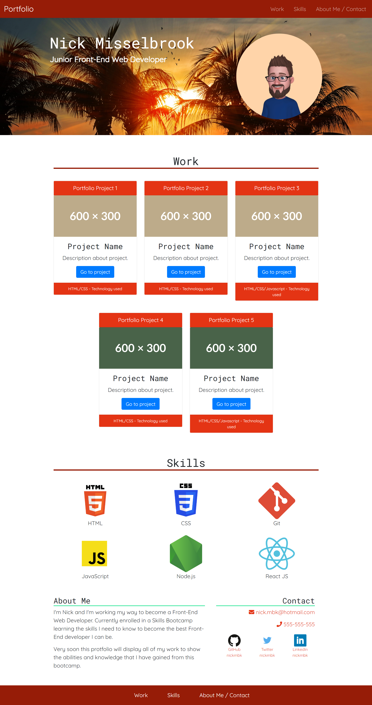

# Bootstrap Portfolio

## Description

This is a portfolio created mostly with Bootstrap 4.0.  It will potentially be my portfolio that employers will be able to see and will assist me in getting a job in Front-End Web Development.
A combination of HtML, CSS and Bootstrap were used, but by using Bootstrap it minimised my use of CSS, especially media queries.

A took a short time to get my head around using Bootstrap, even though we had done some work in class, it still took a bit of time, especially when trying to use parts of Bootstrap that we hadn't used in clase, such as margins and padding.  But once I got used to checking the documentation for what I needed to do, it ended up becoming like second nature, the naming of the classes, for example, became quite intuitive once I knew the layout of them.

Using Bootstrap greatly reduced the amount of CSS I used and the only parts I used media queries for was to make my font sizes responsive and to make some logos responsive.

One issue I had, which I've had no joy of overcoming, I wanted to change the font color of the Navbar at the top of the page, but in doing this it made the hamburger menu in the corner of smaller width pages dissappear, it was still there but it wasn't visible.  I tried several ways to change the button, but every time the three lines on the button would not appear.  This resulted in me keeping a Bootstrap class to keep the button visible but has darkened the text in the Navbar, making it not as clear as I would like it to be.

As I progress throught the Bootcamp, projects will be added in place of the placeholders.  I also want to update the portfolio with a photo of myself.  

## Table of Contents

- [Installation](#installation)
- [Usage](#usage)
- [Credits](#credits)
- [License](#license)

##  Installation

This Bootstrap Portfolio can be found at [Nick Misselbrook Bootstrap Portfolio](https://nickmbk.github.io/Bootstrap-Portfolio/)

## Usage

You will find the Navbar at the top of the page that will take you to each section, Work, Skills and About Me / Contact.

The Work section will display the projects that I will complete on the bootcamp for any potential employers to be able to see what my capabilities are.  Each project displays a picture, a title and description, and what technologies were used for that project.

In the Skills section I have displayed what technologies I will have learned by the end of the bootcamp.

I have written a short description about what I am trying to achieve in the About Me section and alongside that is my contact information, inluding links to my GitHub, Twitter and LinkedIn profiles.

## Credits

Resources that I have used throughout this project have been:
Bootstrap 4.0 Documentation:

- [Bootstrap 4.0 Documentation](https://getbootstrap.com/docs/4.0/getting-started/introduction/)

The following Medium article to create a responsive font-size system, I made adjustments to this to be able to work in CSS as it is written in SCSS:

- [CodyHouse - Design System](https://medium.com/codyhouse/create-your-design-system-part-1-typography-7c630d9092bd)

I wanted to flip and image and found this solution on W3Schools website:

- [How to flip an image](https://www.w3schools.com/howto/howto_css_flip_image.asp)

## License

I used no license for this project.